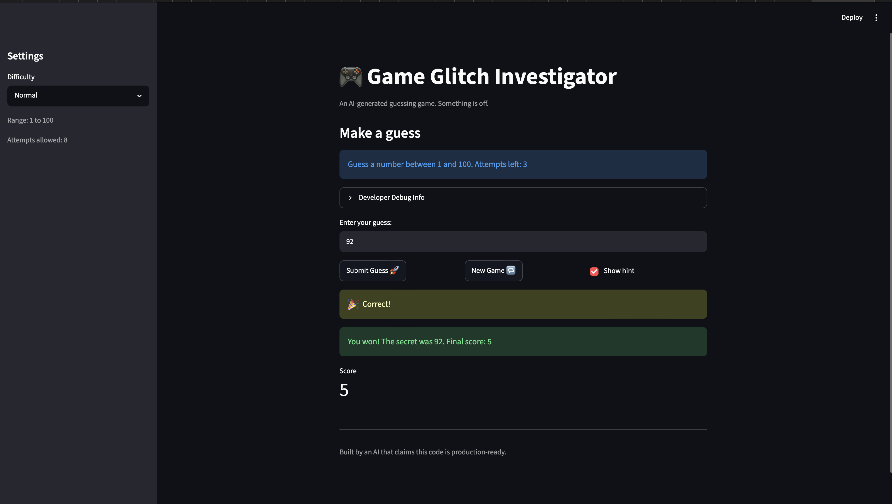

# 🎮 Game Glitch Investigator: The Impossible Guesser

## 🚨 The Situation

You asked an AI to build a simple "Number Guessing Game" using Streamlit.
It wrote the code, ran away, and now the game is unplayable.

- You can't win.
- The hints lie to you.
- The secret number seems to have commitment issues.

## 🛠️ Setup

1. Install dependencies: `pip install -r requirements.txt`
2. Run the broken app: `python -m streamlit run app.py`

## 🕵️‍♂️ Your Mission

1. **Play the game.** Open the "Developer Debug Info" tab in the app to see the secret number. Try to win.
2. **Find the State Bug.** Why does the secret number change every time you click "Submit"? Ask ChatGPT: *"How do I keep a variable from resetting in Streamlit when I click a button?"*
3. **Fix the Logic.** The hints ("Higher/Lower") are wrong. Fix them.
4. **Refactor & Test.**
   - Move the logic into `logic_utils.py`.
   - Run `pytest` in your terminal.
   - Keep fixing until all tests pass!

## 📝 Document Your Experience

1. The game is a number-guessing game built with Streamlit: the player guesses a hidden number and gets "higher/lower" hints until they win or run out of attempts.

2. Bugs found: (1) inverted hint messages — "Too High" told the player to go higher; (2) the secret was cast to a string on even attempts, making wins impossible and triggering TypeErrors; (3) scoring added points for some wrong guesses, and the attempt counter started at 1 instead of 0.

3. Fixes applied: corrected the hint messages, removed the string cast so the secret stays an int, made wrong guesses consistently subtract 5, reset the attempt counter to 0, and refactored all logic into logic_utils.py with passing pytest tests.

## 📸 Demo Walkthrough

1. User selects "Normal" difficulty (range 1–100, 8 attempts).
2. User enters a guess of 80 → game returns "Too High → Go LOWER!"
3. User enters a guess of 40 → game returns "Too Low → Go HIGHER!"
4. Score decreases by 5 for each incorrect guess.
5. User enters the secret number → win, balloons, and final score shown.
6. "New Game" resets the board and starts a fresh round.

**Screenshot** *(optional)*: 

## 🧪 Test Results